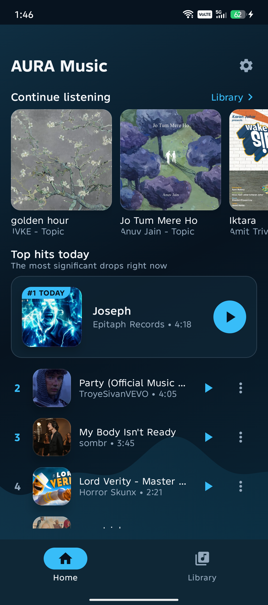
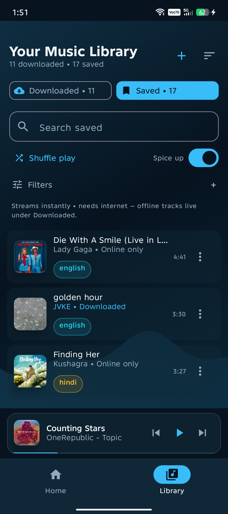
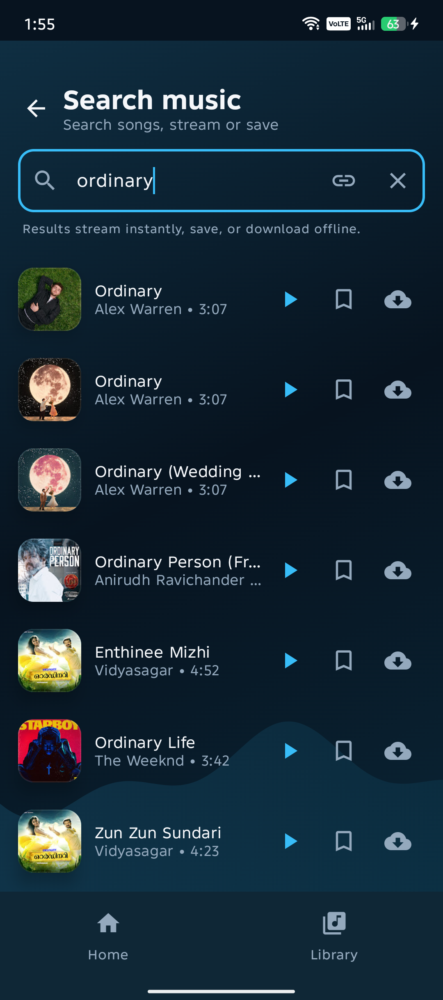
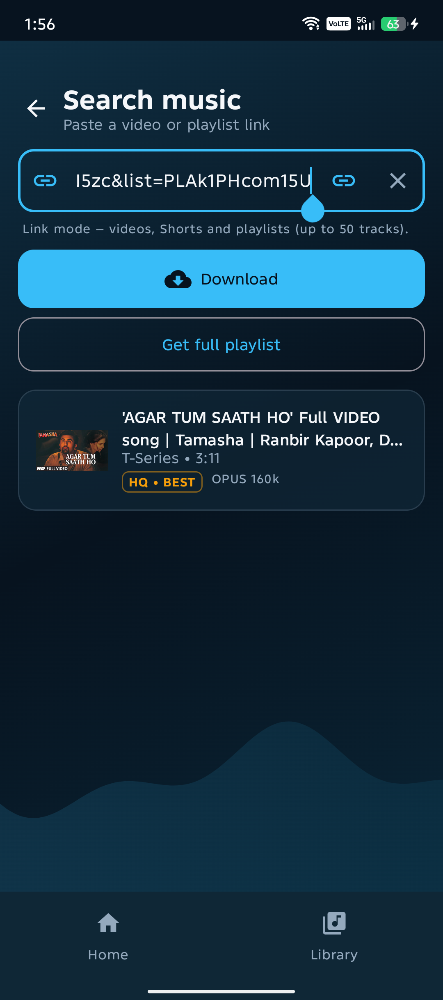
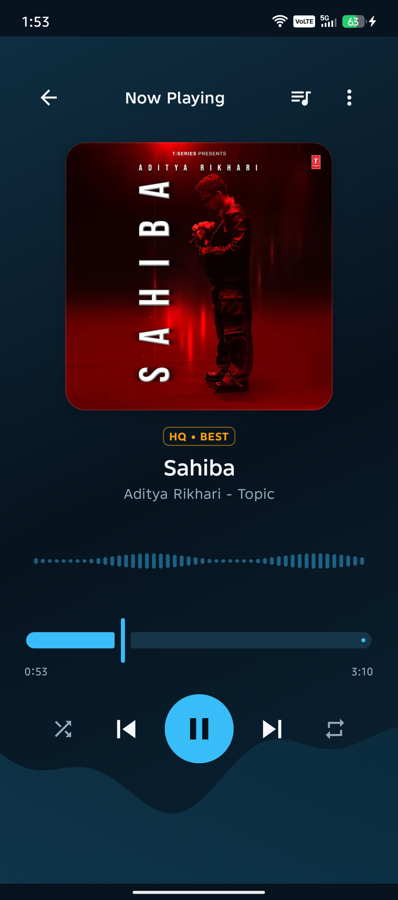
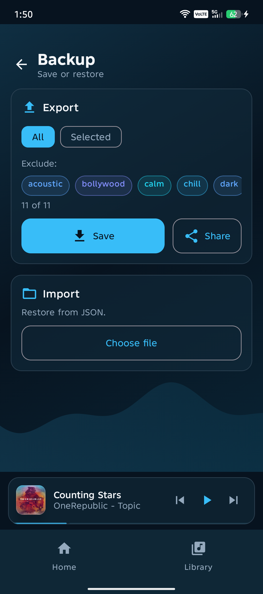

# Aura Music — Modern Offline Music Player for Android

**Website:** https://listen-aura.vercel.app/ · **Download:** [GitHub Releases](https://github.com/Ai-Chetan/Aura-Music/releases)

> **Open source (MIT) — contributors welcome.** Aura is built in the open: no hidden servers, no closed SDKs.
> Browse the [source](https://github.com/Ai-Chetan/Aura-Music), [report an issue](https://github.com/Ai-Chetan/Aura-Music/issues),
> or open a PR — see [`CONTRIBUTING.md`](CONTRIBUTING.md). Newcomers welcome.

A private, on-device music player: paste a YouTube link, keep the best-available audio, organize everything with tags, and listen through a futuristic animated UI with full system playback integration.

> **Music rights:** Aura is a private player — not a music provider. It doesn't own any songs and claims no rights over them. All music, album art, and names belong to their respective artists, labels, and rights holders (YouTube™ is a trademark of Google LLC). Aura only keeps what *you* choose on your own phone for private offline listening, with no sharing or redistribution built in. Please save only content you own or have permission to keep, and respect creators and platform terms.

> **Responsible-use note:** Aura saves audio for your own private listening only. Automated downloading may conflict with YouTube's Terms of Service — only save content you have the right to keep, and never redistribute downloaded files. The app contains no sharing or bulk-export features by design.

## Screenshots

| Home | Library | Add (search) |
|---|---|---|
|  |  |  |

| Add (paste link) | Now playing | Backup |
|---|---|---|
|  |  |  |

Full set (Home, Library tabs, queue, search, notification, lock screen): [`docs/screenshots/`](docs/screenshots/).

## Features

- **Getting started guide** — skippable first-launch tour with floating coach tips over the real UI, plus tappable starter-track suggestions that download in the background.
- **YouTube Music search + instant play** — search songs in the Add section: tap ▶ to stream instantly without saving, or ⤓ to save to the vault via the normal download pipeline.
- **Combined Add section** — Search and Paste-link live under one segmented toggle with shared chrome; prefilled/shared links open straight on Paste link.
- **YouTube → local audio** — paste any link: single videos, Shorts, playlists (up to 50 tracks), or a video shared from inside a playlist (offers the whole list in one tap). Preview, progress, and per-video failure isolation. Best stream kept as-is (Opus/AAC, no re-encode); `HQ • BEST` / `HQ` quality badges.
- **Playlist imports that survive navigation** — whole-playlist downloads run in a dedicated WorkManager worker, so leaving the Add screen can't abort them halfway; live per-playlist progress in Library.
- **Live download queue** — collapsible Downloading card with overall % (tap to expand per-song rows), cancel support, and a starter-batch report that prints every failure's reason with retry.
- **Throttling-hardened pipeline** — gated YouTube concurrency (max 3), exponential-backoff retries with jitter, staggered batch starts, friendly (non-raw) error messages.
- **Tag-powered library** — many-to-many tags, AND/OR multi-tag filter, title/artist search, per-song tag editor, starter tags on first launch.
- **Library sorting** — recently added, oldest, title A–Z/Z–A, artist A–Z, longest/shortest first; changing sort snaps back to the top. Batched rendering keeps large vaults fast.
- **Saved streaming bookmarks** — save a track without downloading it; the Saved tab streams it near-instantly (pre-warmed stream URLs + ExoPlayer disk cache) with the same tag/filter/sort tooling as downloads.
- **Home hub** — continue listening (merges recently played downloads *and* Saved), today's top hits, and For You picks driven by your live rotation.
- **Recommendation engine & infinite radio** — an on-device taste model learns from plays, replays, and early skips (per track *and* per artist). Top-hits, For-You, and search taps start a radio session where every following song is recommended; Saved/downloads play in order and quietly continue with recommendations at the playlist's dead end. Radio never terminates — every track change re-arms the search for picks.
- **Playlist controls in Library** — one-tap **Shuffle play** for either tab (respects active filters), and a **Spice up** switch that keeps recommended picks flowing in behind the playing playlist (playlist order always wins first).
- **Real player** — ExoPlayer via Media3 `MediaSessionService`: queue, play-next, reorder, shuffle, repeat off/one/all, background playback, media notification + lock-screen controls. Swipe the Now Playing artwork to change tracks; swipe the mini player card to skip with a full follow-the-finger fly-out animation.
- **Animated UI** — Compose + Material 3 with an ambient gradient background (animated on Now Playing only), live audio-reactive waveform, glass cards, tag chips, mini-player shell.
- **Backup & restore** — versioned JSON export (full / exclude-tags / selected songs) with share sheet, plus validated import that re-downloads and merges tags.

## Tech stack

| Layer | Choice |
|---|---|
| Language / UI | Kotlin, Jetpack Compose + Material 3 |
| Playback | Media3 (ExoPlayer + MediaSession) |
| Extraction | NewPipeExtractor (on-device, no API key) |
| Database | Room (songs, tags, saved bookmarks, play/skip stats, queue state) + DataStore (prefs, listening stats) |
| Background work | WorkManager + Coroutines/Flow |
| DI | Hilt |
| Storage | App-specific external storage (no storage permission needed) |
| Images / network | Coil, OkHttp |

Full details: [`docs/architecture.md`](docs/architecture.md) · [`docs/data-model.md`](docs/data-model.md)

## Getting started

**Prerequisites:** Android Studio (recent stable), JDK 17, an Android device or emulator (API 26+).

```bash
git clone https://github.com/Ai-Chetan/Aura-Music.git
cd Aura-Music
```

1. Open the project in Android Studio and let Gradle sync.
2. Run the `app` configuration on your device/emulator.
3. Take the Getting Started tour (or skip it), then search a song on the Add tab → stream it or save it; or paste a YouTube link → preview → download → tag it in the song page.

No API keys, no backend, no accounts. Everything runs on-device.

## Project structure

```
app/src/main/java/com/aura/music/
├─ ui/          theme, home (continue listening / top hits / for you), library,
│               player, add (search + paste-link), addsong (paste-link panel),
│               search (search panel hosted by Add), songdetail, backup,
│               settings, navigation, components, tour (guided tour over the
│               live UI), onboarding (starter tracks + view model backing
│               the tour finish panel)
├─ domain/      repository interfaces
├─ data/        Room db (v8 + migrations), NewPipe extraction (+ politeness gate),
│               WorkManager download + playlist-import workers, repo impls,
│               backup codec, stream/queue session management, recommendation
│               engine + listening-stats store, network/data gate, prefs (DataStore)
├─ playback/    MediaSessionService, MediaController wrapper (+ skip detection),
│               audio visualizer
├─ di/          Hilt modules
└─ util/        YouTube URL handling, time formatting
```

## Docs

- [`docs/overview.md`](docs/overview.md) — what Aura is, goals, constraints
- [`docs/architecture.md`](docs/architecture.md) — tech stack, extraction pipeline, package layout
- [`docs/data-model.md`](docs/data-model.md) — Room schema, repository + playback contracts, backup format
- [`docs/build-guide.md`](docs/build-guide.md) — build phases and what's next
- [`docs/backlog.md`](docs/backlog.md) — shipped vs planned features

## Permissions

- `INTERNET` — extraction, downloads, artwork
- `FOREGROUND_SERVICE` / `FOREGROUND_SERVICE_MEDIA_PLAYBACK` — background playback
- `POST_NOTIFICATIONS` — playback notification (asked at runtime on Android 13+)

## Roadmap

Next up: playback speed, sleep timer, crossfade, smart tag-playlists, most-played stats views, home-screen widget. See [`docs/backlog.md`](docs/backlog.md).

## Contributing

Aura is open source under MIT and **contributors are welcome** — code, docs, design, and bug reports all count.

- Good first steps: [open an issue](https://github.com/Ai-Chetan/Aura-Music/issues), improve docs in `docs/`, polish UI tokens in `ui/theme/`, or fix a small bug.
- One focused change per PR, with what you tested (device/API level helps).
- Full guidelines: see [`CONTRIBUTING.md`](CONTRIBUTING.md).

## License

MIT — see [`LICENSE`](LICENSE). Note that third-party dependencies carry their own licenses (in particular, NewPipeExtractor is GPL-3.0).

## Author

Developed by [@Ai-Chetan](https://github.com/Ai-Chetan) for the open-source community.

Aura is developed in the open at [Ai-Chetan/Aura-Music](https://github.com/Ai-Chetan/Aura-Music) — stars, forks, issues, and PRs are all welcome.

*All songs, artwork, and trademarks belong to their respective owners. Aura hosts no music and claims no rights — your private player only.*
