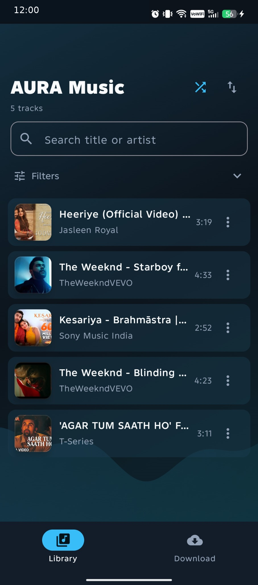
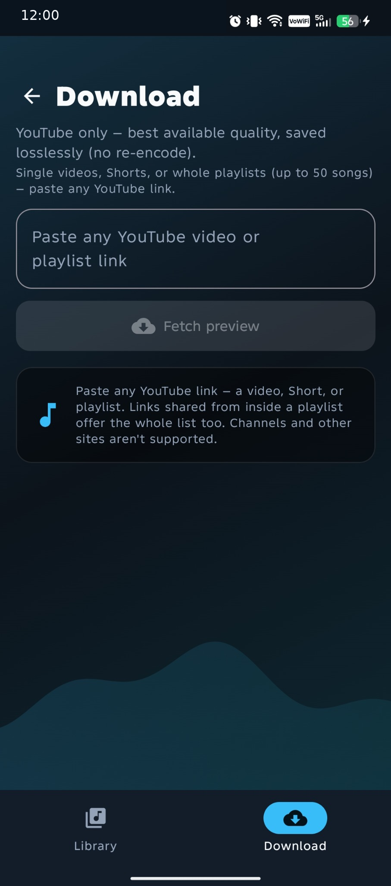
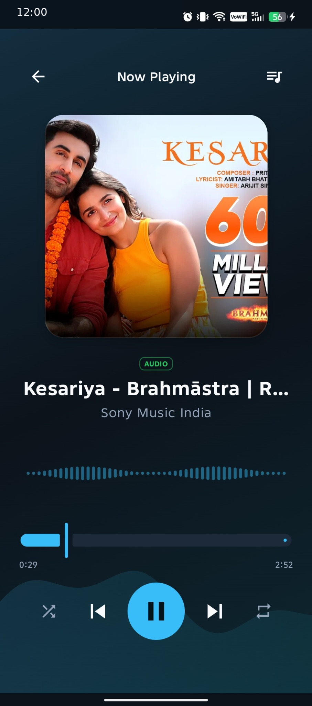
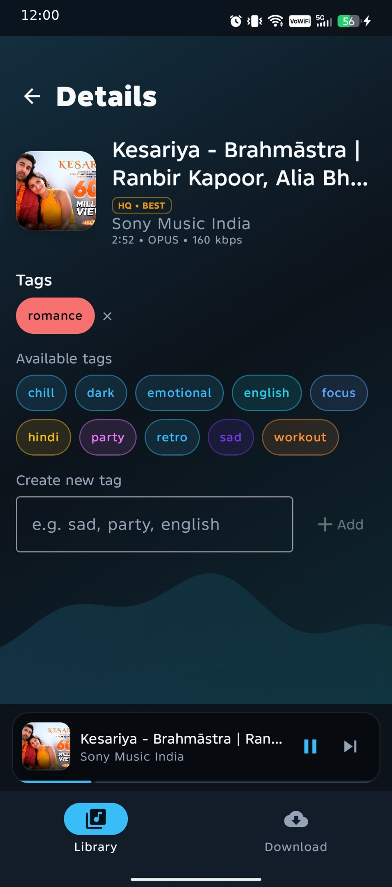
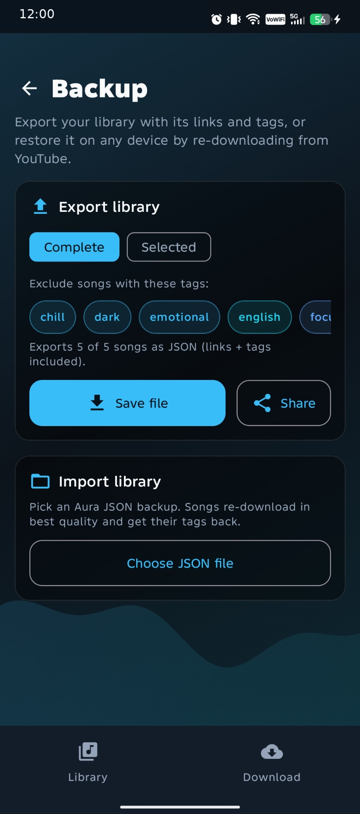
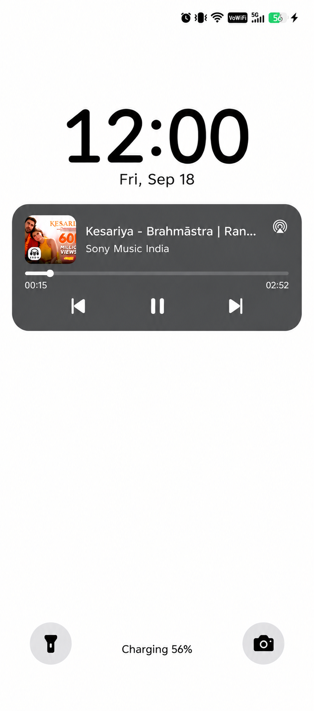

# Aura — Personal Music Vault for Android

A private, on-device music player: paste a YouTube link, keep the best-available audio, organize everything with tags, and listen through a futuristic animated UI with full system playback integration.

> **Responsible-use note:** Aura saves audio for your own private listening only. Automated downloading may conflict with YouTube's Terms of Service — only save content you have the right to keep, and never redistribute downloaded files. The app contains no sharing or bulk-export features by design.

## Screenshots

| Library | Download | Now playing |
|---|---|---|
|  |  |  |

| Song detail | Backup | Lock screen |
|---|---|---|
|  |  |  |

> **Note:** these screenshots show an older UI — the app has since been redesigned (new Library, combined Add section, guided onboarding). Updated screenshots are on the way.

## Features

- **Getting started guide** — skippable first-launch tour with floating coach tips over the real UI, plus tappable starter-track suggestions that download in the background.
- **YouTube Music search + instant play** — search songs in the Add section: tap ▶ to stream instantly without saving, or ⤓ to save to the vault via the normal download pipeline.
- **Combined Add section** — Search and Paste-link live under one segmented toggle with shared chrome; prefilled/shared links open straight on Paste link.
- **YouTube → local audio** — paste any link: single videos, Shorts, playlists (up to 50 tracks), or a video shared from inside a playlist (offers the whole list in one tap). Preview, progress, and per-video failure isolation. Best stream kept as-is (Opus/AAC, no re-encode); `HQ • BEST` / `HQ` quality badges.
- **Playlist imports that survive navigation** — whole-playlist downloads run in a dedicated WorkManager worker, so leaving the Add screen can't abort them halfway; live per-playlist progress in Library.
- **Live download queue** — collapsible Downloading card with overall % (tap to expand per-song rows), cancel support, and a starter-batch report that prints every failure's reason with retry.
- **Throttling-hardened pipeline** — gated YouTube concurrency (max 3), exponential-backoff retries with jitter, staggered batch starts, friendly (non-raw) error messages.
- **Tag-powered library** — many-to-many tags, AND/OR multi-tag filter, title/artist search, per-song tag editor, starter tags on first launch.
- **Library sorting** — recently added, oldest, title A–Z/Z–A, artist A–Z, longest/shortest first; changing sort snaps back to the top. Batched rendering keeps large vaults fast.
- **Real player** — ExoPlayer via Media3 `MediaSessionService`: queue, play-next, reorder, shuffle, repeat off/one/all, background playback, media notification + lock-screen controls. Swipe the Now Playing artwork to change tracks.
- **Animated UI** — Compose + Material 3 with an ambient gradient background (animated on Now Playing only), live audio-reactive waveform, glass cards, tag chips, mini-player shell.
- **Backup & restore** — versioned JSON export (full / exclude-tags / selected songs) with share sheet, plus validated import that re-downloads and merges tags.

## Tech stack

| Layer | Choice |
|---|---|
| Language / UI | Kotlin, Jetpack Compose + Material 3 |
| Playback | Media3 (ExoPlayer + MediaSession) |
| Extraction | NewPipeExtractor (on-device, no API key) |
| Database | Room (songs, tags, playlists, queue state) |
| Background work | WorkManager + Coroutines/Flow |
| DI | Hilt |
| Storage | App-specific external storage (no storage permission needed) |
| Images / network | Coil, OkHttp |

Full details: [`docs/architecture.md`](docs/architecture.md) · [`docs/data-model.md`](docs/data-model.md)

## Getting started

**Prerequisites:** Android Studio (recent stable), JDK 17, an Android device or emulator (API 26+).

```bash
git clone https://github.com/Ai-Chetan/Aura-Music.git
cd Aura-Music
```

1. Open the project in Android Studio and let Gradle sync.
2. Run the `app` configuration on your device/emulator.
3. Take the Getting Started tour (or skip it), then search a song on the Add tab → stream it or save it; or paste a YouTube link → preview → download → tag it in the song page.

No API keys, no backend, no accounts. Everything runs on-device.

## Project structure

```
app/src/main/java/com/aura/music/
├─ ui/          theme, library, player, add (search + paste-link), onboarding,
│               search, addsong, songdetail, backup, navigation, components
├─ domain/      repository interfaces
├─ data/        Room db, NewPipe extraction (+ politeness gate), WorkManager
│               download + playlist-import workers, repo impls, backup codec,
│               onboarding prefs (DataStore)
├─ playback/    MediaSessionService, MediaController wrapper, audio visualizer
├─ di/          Hilt modules
└─ util/        YouTube URL handling, time formatting
```

## Docs

- [`docs/overview.md`](docs/overview.md) — what Aura is, goals, constraints
- [`docs/architecture.md`](docs/architecture.md) — tech stack, extraction pipeline, package layout
- [`docs/data-model.md`](docs/data-model.md) — Room schema, repository + playback contracts, backup format
- [`docs/build-guide.md`](docs/build-guide.md) — build phases and what's next
- [`docs/backlog.md`](docs/backlog.md) — shipped vs planned features

## Permissions

- `INTERNET` — extraction, downloads, artwork
- `FOREGROUND_SERVICE` / `FOREGROUND_SERVICE_MEDIA_PLAYBACK` — background playback
- `POST_NOTIFICATIONS` — playback notification (asked at runtime on Android 13+)

## Roadmap

Next up: playback speed, sleep timer, crossfade, smart tag-playlists, most/recently-played views, home-screen widget, refreshed screenshots of the new UI. See [`docs/backlog.md`](docs/backlog.md).

## Contributing

Issues and PRs are welcome — see [`CONTRIBUTING.md`](CONTRIBUTING.md).

## License

MIT — see [`LICENSE`](LICENSE). Note that third-party dependencies carry their own licenses (in particular, NewPipeExtractor is GPL-3.0).
